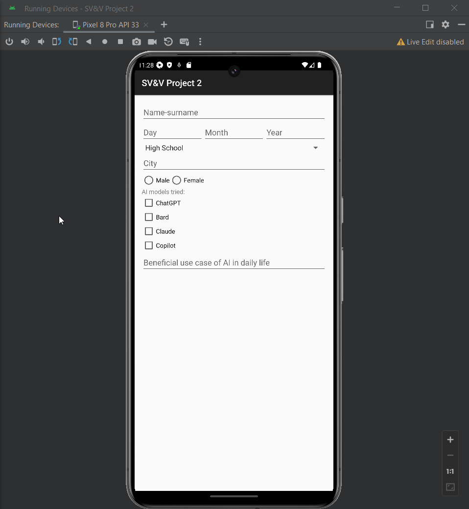
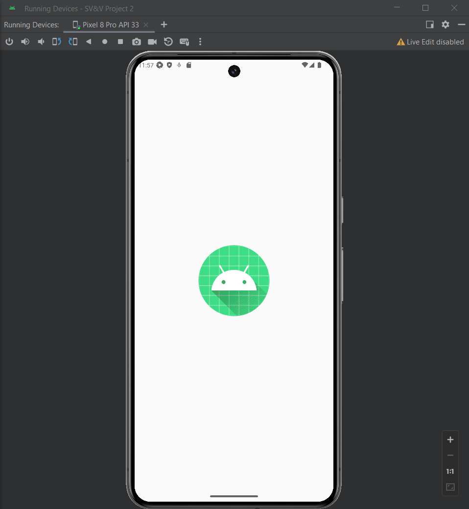
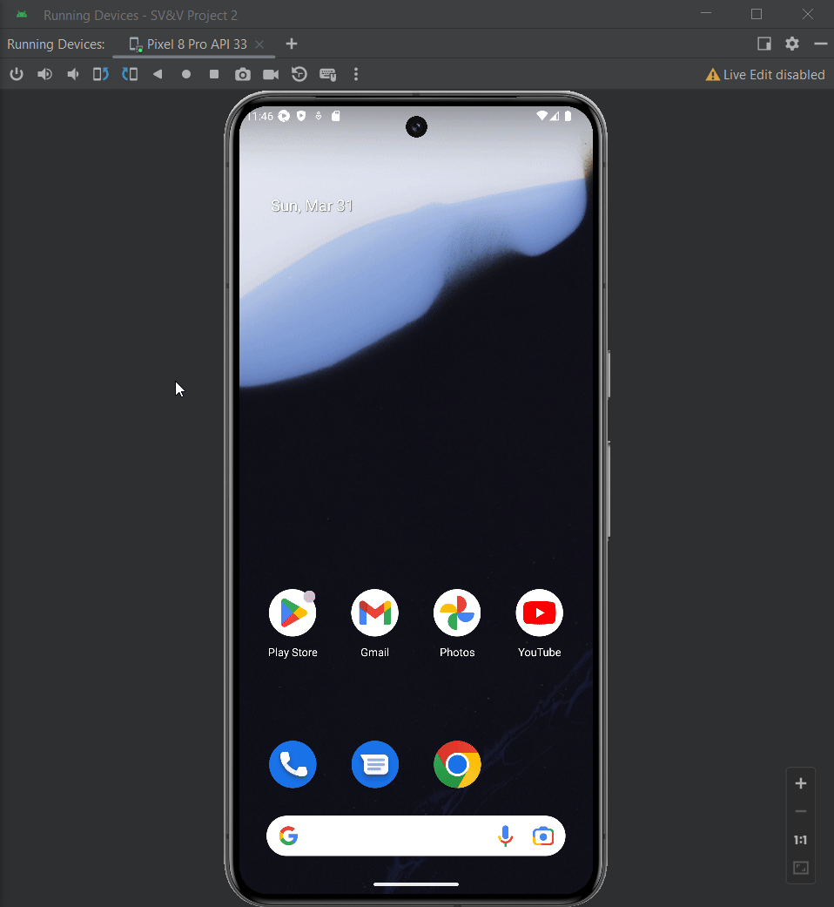

# Appium Setup and Running Tests
This guide provides instructions on setting up Appium and running tests for the Android app using Android Studio.

## Prerequisites
- Node.js and npm (Node Package Manager) installed on your machine
- Android SDK installed
- Android Studio installed
- Java Development Kit (JDK) installed
- Android device or emulator for running the tests

## Setup
Install Appium globally using npm:

```shell
npm install -g appium
```
Install Appium Doctor globally using npm:

```shell
npm install -g appium-doctor
```

Run Appium Doctor to check your Appium configuration:

```shell
appium-doctor
```
Appium Doctor will verify if your system is properly set up for Appium. If any issues are reported, follow the provided instructions to resolve them.

Install the UiAutomator2 driver using Appium:

```shell
appium driver install uiautomator2
```

## Running Appium
Open a command line or terminal.
Start the Appium server by running the following command:

```shell
appium
```
Appium will start running and listen for test requests.

# Tests

## testSendButtonVisiblity
Fills all fields, and ensures that send button is visible. After that a field is cleared and its checked whether send button is invisible.


## testIncompleteInput
Fills some fields and checks for default submissions for education level selection and AI Models used.


## testAIModelCheckboxBehavior
Ensures that the text field for AI model selection appears and disappears with checkbox click.
